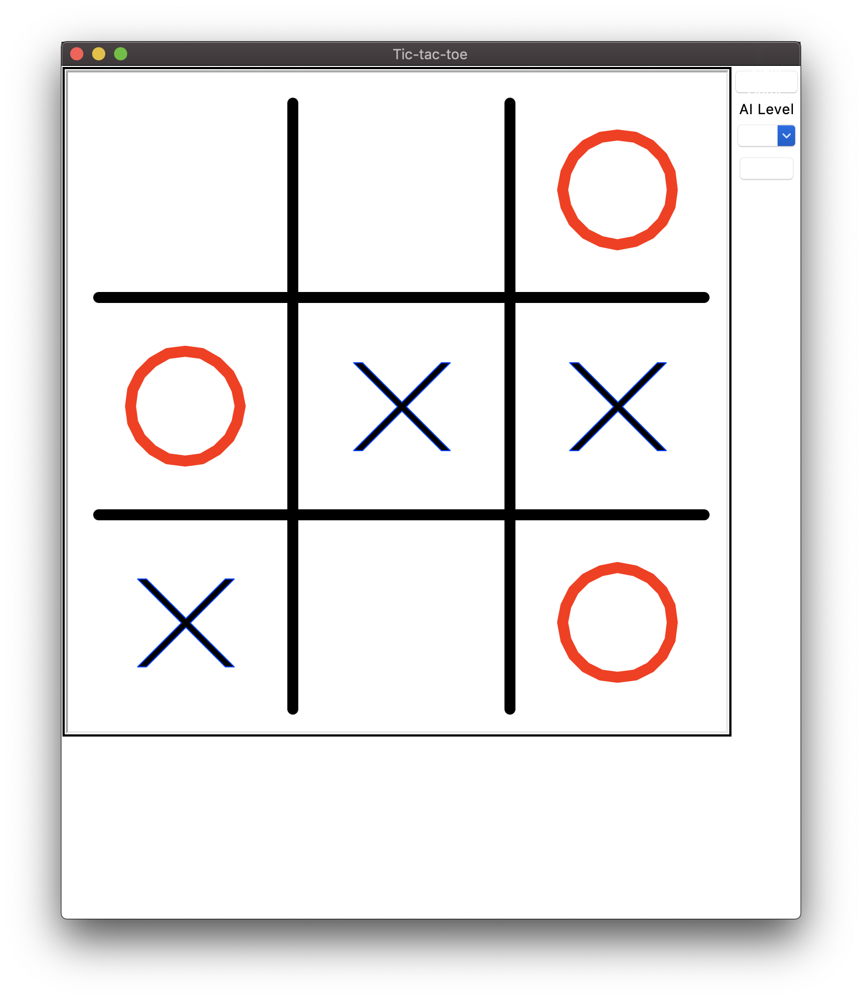

# Tic-tac-toe

This is an implementation of a simple [Tic-tac-toe](https://en.wikipedia.org/wiki/Tic-tac-toe) game with 3 levels
of difficulty. It comes with a simple-to-use GUI.

## Algorithm

The best move for a computer is determined by the [Minimax](https://en.wikipedia.org/wiki/Minimax) algorithm.
For a game as simple as 3 X 3 Tic-tac-toe, [alpha-beta pruning](https://en.wikipedia.org/wiki/Alpha%E2%80%93beta_pruning) is not needed,
and a simple minimax with [memoization](https://en.wikipedia.org/wiki/Memoization) is sufficient.

## License

[MIT License](LICENSE)
